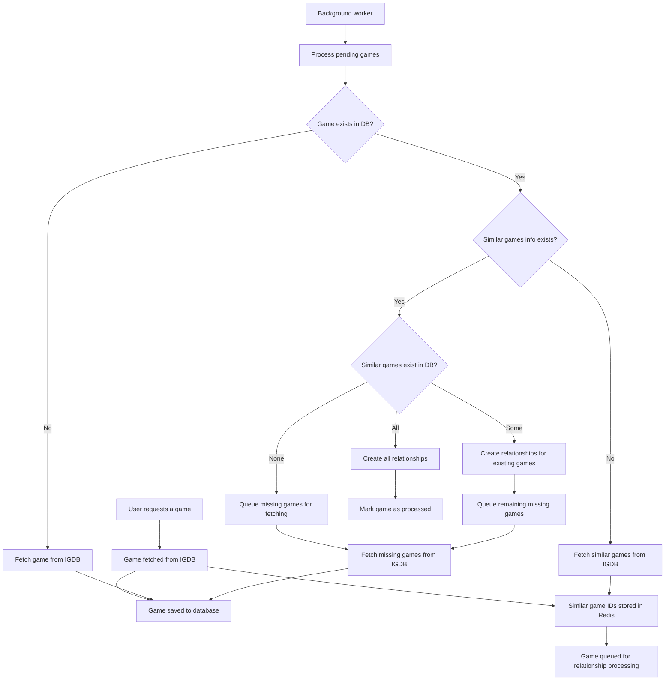

# Similar Games System

This document explains how the similar games system works in the Quokka application.

## Overview

The similar games system is designed to:

1. Store relationships between games and their similar games
2. Fetch missing games from IGDB
3. Create database relationships when both games exist
4. Process everything in the background to avoid blocking user requests

## System Components

- **Redis Storage**: Stores relationship information and processing state
- **Background Worker**: Processes games and creates relationships
- **IGDB API**: Source of game data and similar game relationships
- **SQLite Database**: Stores games and their relationships

## Data Flow

## Key Redis Data Structures

1. **similar_games:relationships** (Hash): Maps game IDs to arrays of similar game IDs

   - Key: Game ID
   - Value: JSON array of similar game IDs

2. **similar_games:pending** (Set): Games waiting to be processed

   - Contains game IDs that need relationship processing

3. **similar_games:processed** (Set): Games that have been processed
   - Contains game IDs that have completed relationship processing

## Processing Flow

1. **Game Discovery**:

   - A game is fetched from IGDB (via search or direct request)
   - The game is saved to the database
   - If the game has similar games, their IDs are stored in Redis
   - The game is queued for relationship processing

2. **Background Processing**:

   - The worker picks games from the pending set
   - For each game, it checks if the game exists in the database
   - If not, it fetches the game from IGDB and tries again later
   - If yes, it proceeds to relationship processing

3. **Relationship Processing**:

   - The worker gets the similar game IDs from Redis
   - It checks which similar games exist in the database
   - It creates relationships for existing games
   - It queues missing games for fetching
   - If some games are still missing, it will try again later

4. **Missing Game Fetching**:
   - Missing games are fetched from IGDB by their IDs
   - These games are saved to the database
   - Their similar game relationships are also stored in Redis
   - This creates a cascading effect that gradually builds the database

## Benefits of This Approach

1. **Decoupled Processing**: Game fetching and relationship creation are separate processes
2. **Background Processing**: All heavy work happens in the background
3. **Resilient to Failures**: Failed operations are retried automatically
4. **Gradual Database Building**: The database grows organically based on user interactions
5. **No Foreign Key Errors**: Relationships are only created when both games exist
6. **Efficient Resource Usage**: Only relevant games are fetched and processed

## Monitoring and Debugging

The system provides detailed logs and statistics about:

- How many games are pending processing
- How many games have been processed
- How many relationship mappings exist
- The state of the processing queue
