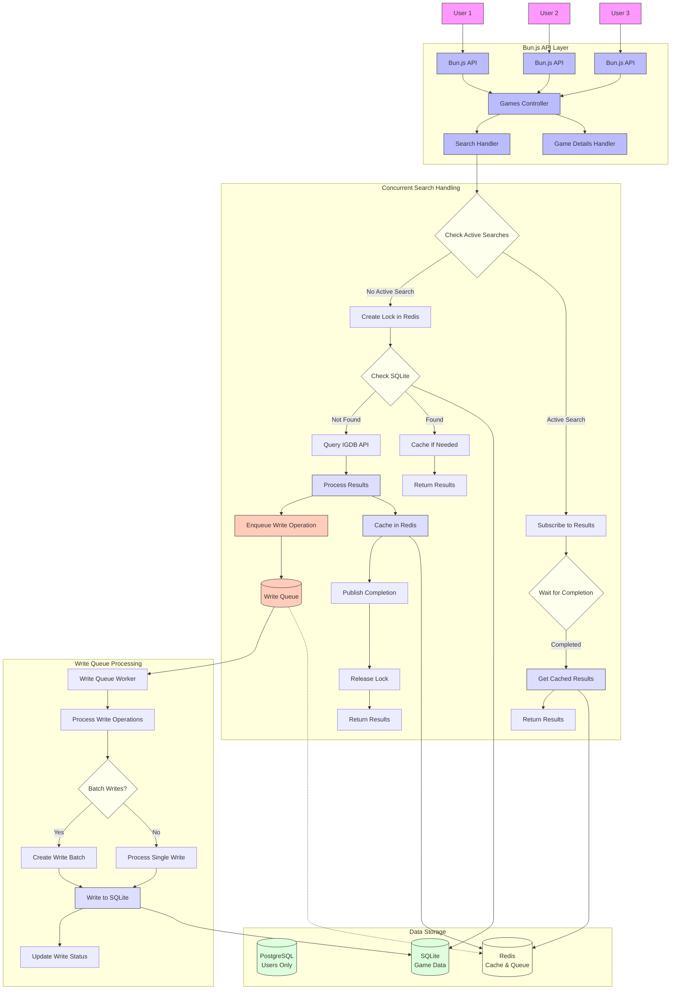

You're right to ask about queues. While the diagram doesn't explicitly show a dedicated queue system, we should incorporate one for better handling of write operations. Let me clarify how queues fit into this architecture:



## Queue Integration Details

1. **Write Queue for SQLite Operations**:

   - All database write operations (from search results, game details, etc.) go through a dedicated write queue
   - The queue can be implemented using Redis Lists or a dedicated queue system like Bull/BullMQ
   - This decouples the API response from the database write operation

2. **Benefits of the Queue Approach**:

   - **Faster API Responses**: Users get search results immediately, without waiting for database writes
   - **Controlled Concurrency**: The queue worker processes writes sequentially, avoiding SQLite write contention
   - **Batching Capability**: Similar write operations can be batched for efficiency
   - **Retry Mechanism**: Failed writes can be retried automatically
   - **Prioritization**: Critical writes can be prioritized over less important ones

3. **Queue Implementation Options**:

   - **Redis-based Queue**: Use Redis Lists with LPUSH/RPOP for a simple queue
   - **BullMQ**: A robust Redis-based queue system with advanced features
   - **Bun's Native Queue**: Implement a lightweight in-memory queue within Bun

4. **Write Operation Flow**:
   - Search results from IGDB are immediately cached in Redis and returned to users
   - Game data is enqueued for writing to SQLite
   - A dedicated worker processes the write queue
   - Write status can be tracked if needed

This queue-based approach effectively handles the SQLite concurrency limitations while maintaining a responsive user experience. It separates the concerns of serving user requests and persisting data, allowing each to be optimized independently.

# Full Process: Searching for "Zelda"

Here's a detailed, step-by-step breakdown of what happens when you search for "Zelda" in the system:

## 1. User Input & API Request

1. You type "Zelda" in the search box
2. Frontend sends a request to the Bun.js API endpoint: `GET /api/games/search?q=zelda`

## 2. Initial Request Handling

3. Bun.js API receives the search request
4. The Search Handler normalizes the query (lowercase, trim spaces)
5. System generates a unique search ID: `search:zelda:1689423567`

## 3. Deduplication Check

6. System checks Redis for an active search lock: `GET search_processing:zelda`
7. If no lock exists, this is the first concurrent request
8. If a lock exists, this is a duplicate request (skip to step 24)

## 4. First Request Path - Lock Creation

9. System creates a lock in Redis: `SET search_processing:zelda 1 EX 10`
10. System checks Redis for cached results: `GET search:zelda`
11. If cache hit and fresh, return results immediately (skip to step 34)

## 5. Database Check

12. System checks SQLite for existing games matching "Zelda":
    ```sql
    SELECT id, name, cover_url, updated_at
    FROM games
    WHERE name LIKE '%zelda%'
    ORDER BY popularity DESC
    LIMIT 20
    ```
13. If sufficient fresh results exist, cache and return them (skip to step 32)

## 6. External API Query

14. System prepares and sends a request to IGDB API:
    ```
    POST https://api.igdb.com/v4/games
    fields name,cover.url,summary,rating,release_dates.*;
    search "zelda";
    limit 20;
    ```
15. IGDB processes the request and returns matching Zelda games

## 7. Result Processing

16. System receives IGDB response with 15 Zelda games
17. System transforms the data to match internal schema
18. System adds metadata (search timestamp, source, etc.)

## 8. Caching Results

19. System immediately caches search results in Redis:
    ```
    SET search:zelda {game_ids:[123,456,789,...],timestamp:1689423567} EX 86400
    ```
20. For each game, system caches individual game data:
    ```
    SET game:123 {game_data_json} EX 604800
    ```

## 9. Queue Write Operation

21. System enqueues a write operation to the SQLite write queue:
    ```
    LPUSH sqlite_write_queue {
      operation: "batch_insert",
      table: "games",
      data: [{game1_data}, {game2_data}, ...],
      search_id: "search:zelda:1689423567"
    }
    ```

## 10. Publish Completion & Release Lock

22. System publishes completion event:
    ```
    PUBLISH search_channel:zelda {status:"complete",ids:[123,456,789,...]}
    ```
23. System releases the search lock:
    ```
    DEL search_processing:zelda
    ```

## 11. Duplicate Request Path

24. For concurrent requests, system subscribes to completion channel:
    ```
    SUBSCRIBE search_channel:zelda
    ```
25. System sets a timeout (e.g., 5 seconds) for the subscription
26. When completion event is received, system retrieves cached results
27. If timeout occurs, system falls back to processing as a new request

## 12. Background Write Processing

28. Write Queue Worker picks up the write operation:
    ```
    BRPOP sqlite_write_queue 0
    ```
29. Worker processes the batch insert into SQLite:
    ```sql
    INSERT INTO games (id, name, cover_url, ...)
    VALUES (?, ?, ?, ...), (?, ?, ?, ...), ...
    ON CONFLICT(id) DO UPDATE SET ...
    ```
30. Worker updates write status in Redis:
    ```
    SET write_status:search:zelda:1689423567 "complete"
    ```

## 13. Result Preparation & Return

31. System formats the search results for the API response
32. System includes freshness indicators and metadata
33. System may include popularity metrics or recommendations
34. System returns the formatted results to the client

## 14. Frontend Display

35. Frontend receives the search results
36. Frontend renders the list of Zelda games
37. You see the search results on your screen, typically within 100-300ms of your initial request

## 15. User Interaction with Results

38. You click on "The Legend of Zelda: Breath of the Wild"
39. Frontend requests game details: `GET /api/games/123`
40. System retrieves the game from SQLite (already stored from the search)
41. System returns complete game details to the frontend
42. You see the detailed game page

## 16. Adding to Library

43. You click "Add to Library"
44. Frontend sends: `POST /api/users/me/library` with game ID
45. System adds the game to your library in PostgreSQL
46. System confirms the addition
47. Game appears in your library

This entire process is optimized to:

1. Provide immediate responses to users
2. Deduplicate concurrent identical searches
3. Efficiently cache both search queries and game data
4. Handle database writes in a controlled manner
5. Maintain data freshness through background updates

The architecture ensures that even with high concurrency, the system remains responsive and data consistency is maintained.

Yes, in all cases, when you make the request `GET /api/games/search?q=zelda`, you will receive a JSON response with search results. The system is designed to always return a response, regardless of the internal path it takes to get those results.

## JSON Response in All Scenarios

### Scenario 1: Cache Hit

```json
{
  "results": [
    {
      "id": 1025,
      "name": "The Legend of Zelda: Breath of the Wild",
      "cover_url": "https://images.igdb.com/igdb/image/upload/t_cover_big/co3p2d.jpg",
      "release_date": "2017-03-03",
      "rating": 93.4,
      "summary": "Step into a world of discovery, exploration, and adventure..."
    },
    {
      "id": 7346,
      "name": "The Legend of Zelda: Tears of the Kingdom",
      "cover_url": "https://images.igdb.com/igdb/image/upload/t_cover_big/co5vmg.jpg",
      "release_date": "2023-05-12",
      "rating": 95.2,
      "summary": "The adventure continues in the sequel to The Legend of Zelda: Breath of the Wild..."
    }
    // ... more results
  ],
  "meta": {
    "total": 42,
    "source": "cache",
    "freshness": "fresh",
    "query_time_ms": 12
  }
}
```

### Scenario 2: SQLite Hit

```json
{
  "results": [
    // Same game data format as above
  ],
  "meta": {
    "total": 42,
    "source": "database",
    "freshness": "fresh",
    "query_time_ms": 45
  }
}
```

### Scenario 3: IGDB Query (New Search)

```json
{
  "results": [
    // Same game data format as above
  ],
  "meta": {
    "total": 42,
    "source": "igdb",
    "freshness": "fresh",
    "query_time_ms": 230
  }
}
```

### Scenario 4: Concurrent Request (Waiting for First Request)

```json
{
  "results": [
    // Same game data format as above
  ],
  "meta": {
    "total": 42,
    "source": "cache",
    "freshness": "fresh",
    "query_time_ms": 85,
    "deduplicated": true
  }
}
```

## Key Points About the Response

1. **Consistent Format**: The response format is consistent regardless of the data source
2. **Transparent Metadata**: The `meta` section includes information about where the data came from
3. **Always JSON**: The response is always a valid JSON object
4. **Always Returns**: Even if there are no matches, you'll get an empty results array, not an error
5. **Error Handling**: If there's a system error, you'll get a proper error response with appropriate HTTP status code

The internal path (cache, database, IGDB, queue, etc.) is abstracted away from the client. From the client's perspective, it's simply making an API request and getting back search results, with the system handling all the complexity behind the scenes.

This approach provides a consistent, reliable interface for the frontend while allowing the backend to optimize how it retrieves and processes the data.
